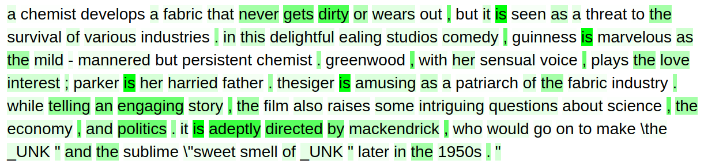
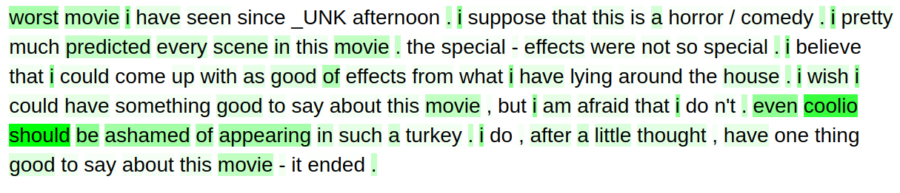

# Anuvada: Interpretable Models for NLP using PyTorch

So, you want to know why your classifier arrived at a particular decision or why your flashy new deep learning classification model is not performing in the way which you would want it to perform? Or there could be bias in your dataset towards a particular class and you want to understand if there are any such edge cases.

One of the common criticisms of deep learning has been it's black box nature. To address this issue, researchers have developed many ways to visualise and explain the inference. It is not necessary that a model has to be explainable, but when important decisions like which jobs to recommend to a person or whether to give a person loan are being made, it would be helpful to cross-check the model's claims. In such domains, self-explainable models are necessary.

This library is an ongoing effort to provide a high-level access to such models by building on top of PyTorch.

Here is what you can expect to visualize from a trained model.

Note: This model is a convolutional neural network trained on IMDB sentiment analysis dataset. I trained the model using
SGD till validation loss stopped increasing. Here is sensitivity analysis on the some sample inputs. You can have a look
in the examples directory for training and visualising the outputs.

#### Positive review

#### Negative review

## Installing

Clone this repo and add it to your python library path.

* [PyTorch](http://pytorch.org)
* [NumPy](http://numpy.org/)
* [Pandas](http://pandas.pydata.org/)
* [Spacy](https://spacy.io/)
* Gensim
* tqdm

## To do list

- [x] Implement Attention with RNN
- [x] Implement Attention Visualisation
- [x] Implement working Fit Module
- [x] Implement support for masking gradients in RNN (Working now!)
- [x] Implement a generic data set loader
- [x] Implement CNN Classifier * (pending) with feature map visualisation
- [x] Sensitivity analysis for generic model (CNN done, pending RNN)
- [x] Implement support for validation split
- [x] Separate modules for CNN and RNN
- [x] Ipmplement GPU Support
- [x] Implement support for custom loss function, learning rate tuning, custom metrics
- [x] Support for loading and saving models
- [ ]  Write documentation
- [ ]  Clean Code
- [ ]  Implement basic validation measures like accuracy

## Acknowledgments

* https://github.com/henryre/pytorch-fitmodule
