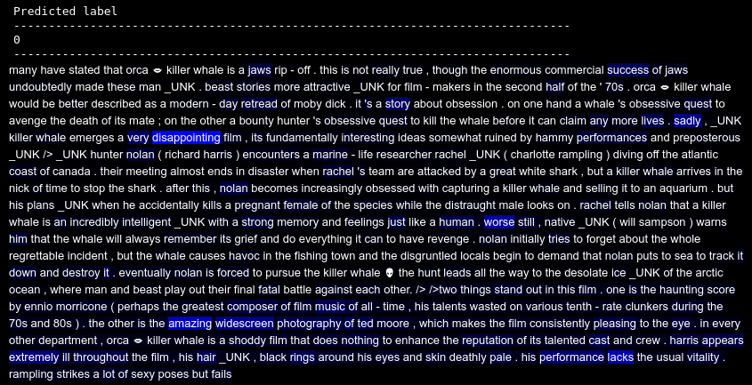

# Anuvada: Interpretable Models for NLP using PyTorch

So, you want to know why your classifier arrived at a particular decision or why your flashy new deep learning classification model is not performing in the way which you would want it to perform? Or there could be bias in your dataset towards a particular class and you want to understand if there are any such edge cases.

One of the common criticisms of deep learning has been it's black box nature. To address this issue, researchers have developed many ways to visualise and explain the inference. It is not necessary that a model has to be explainable, but when important decisions like which jobs to recommend to a person or whether to give a person loan are being made, it would be helpful to cross-check the model's claims. In such domains, self-explainable models are necessary.

This library is an ongoing effort to provide a high-level access to such models by building on top of PyTorch. Here is what you can expect to visualize from a trained model. This package would help you to get started very quickly by closely following sklearn API style. Contributions are welcomed!



## Installing

Clone this repo and add it to your python library path.

* [PyTorch](http://pytorch.org)
* [NumPy](http://numpy.org/)
* [Pandas](http://pandas.pydata.org/)
* [Spacy](https://spacy.io/)
* tqdm

### Getting started

### Importing libraries


```python
import anuvada
import numpy as np
import torch
import pandas as pd
```


```python
from anuvada.models.classification_attention_rnn import AttentionClassifier
```

### Creating the dataset


```python
from anuvada.datasets.data_loader import CreateDataset
from anuvada.datasets.data_loader import LoadData
```


```python
data = CreateDataset()
```


```python
df = pd.read_csv('MovieSummaries/movie_summary_filtered.csv')
```


```python
# passing only the first 512 samples, I don't have a GPU!
y = list(df.Genre.values)[0:512]
x = list(df.summary.values)[0:512]
```


```python
x, y = data.create_dataset(x,y, folder_path='test', max_doc_tokens=500)
```

### Loading created dataset


```python
l = LoadData()
```


```python
x, y, token2id, label2id, lengths_mask = l.load_data_from_path('test')
```

### Change into torch vectors


```python
x = torch.from_numpy(x)
```


```python
y = torch.from_numpy(y)
```

### Create attention classifier


```python
acf = AttentionClassifier(vocab_size=len(token2id)+2,embed_size=25,gru_hidden=25,n_classes=len(label2id))
```


```python
loss = acf.fit(x,y, lengths_mask ,epochs=5, validation_split=0.2)
```

    Epoch 1 / 5
    [========================================] 100%	loss: 3.9904loss: 3.9904

    Epoch 2 / 5
    [========================================] 100%	loss: 3.9851loss: 3.9851

    Epoch 3 / 5
    [========================================] 100%	loss: 3.9783loss: 3.9783

    Epoch 4 / 5
    [========================================] 100%	loss: 3.9739loss: 3.9739

    Epoch 5 / 5
    [========================================] 100%	loss: 3.9650loss: 3.9650


## To do list

- [x] Implement Attention with RNN
- [x] Implement Attention Visualisation
- [x] Implement working Fit Module
- [x] Implement support for masking gradients in RNN (Working now!)
- [x] Implement a generic data set loader
- [ ] Implement CNN Classifier with feature map visualisation
- [ ] Sensitivity analysis for generic model
- [x] Implement support for validation split
- [ ] Separate modules for CNN and RNN
- [x] Implement GPU Support
- [x] Implement support for custom loss function, learning rate tuning, custom metrics
- [x] Support for loading and saving models
- [ ]  Write documentation
- [ ]  Clean Code
- [ ]  Implement basic validation measures like accuracy

## Acknowledgments

* https://github.com/henryre/pytorch-fitmodule
